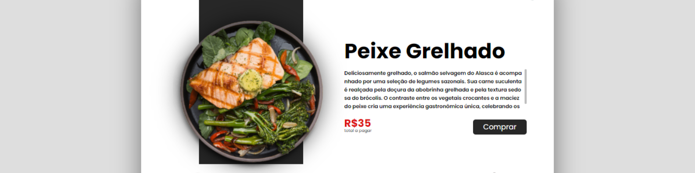
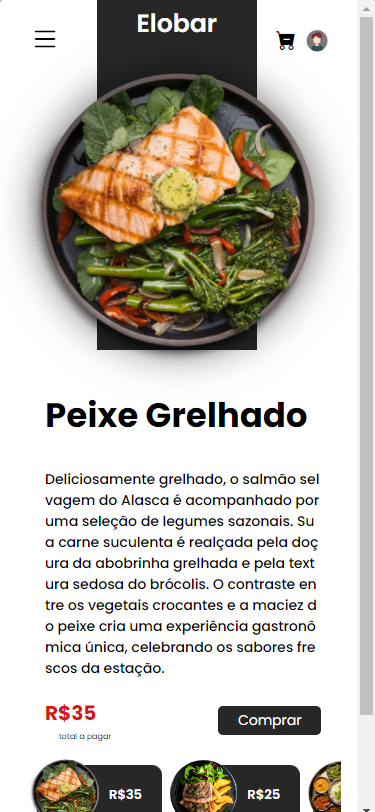
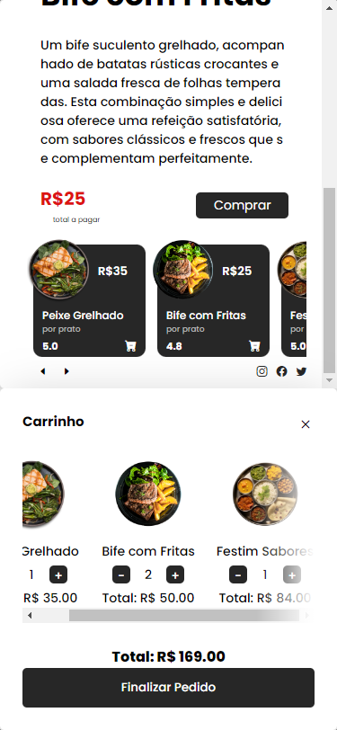

## Access the Project

<a href="https://renancardosodev.github.io/elobar/" target="_blank">https://renancardosodev.github.io/elobar/</a>

## Description

This is a project for a food ordering website where customers can select dishes and add them to their cart for purchase, including the ability to choose the quantity within the cart.

## Features

- **Menu Selection:**
  - Users can browse through a menu of available dishes.

- **Cart Management:**
  - Users can view the items in their cart.
  - They can adjust the quantity of each item or remove items from the cart altogether.
  - Total price dynamically updates as items are added or removed.

- **Responsive Design:**
  - The website is designed to be responsive, ensuring a seamless experience across various devices.

- **Technologies Used:**
  - HTML / CSS / JavaScript

## How to Contribute

If you want to contribute to the development of this project, follow the steps below:

1. Fork the repository.
2. Clone the forked repository to your local environment.
3. Create a branch for your contribution: `git checkout -b your-branch-name`.
4. Make desired changes to the code.
5. Commit the changes: `git commit -m "Description of changes"`.
6. Push to the branch: `git push origin your-branch-name`.
7. Open a Pull Request in the original repository.

## Screenshots

  
  

## Development Environment

Make sure to have a development environment set up with a compatible web browser. We recommend using VSCode as the code editor.

# Author

Your Name
